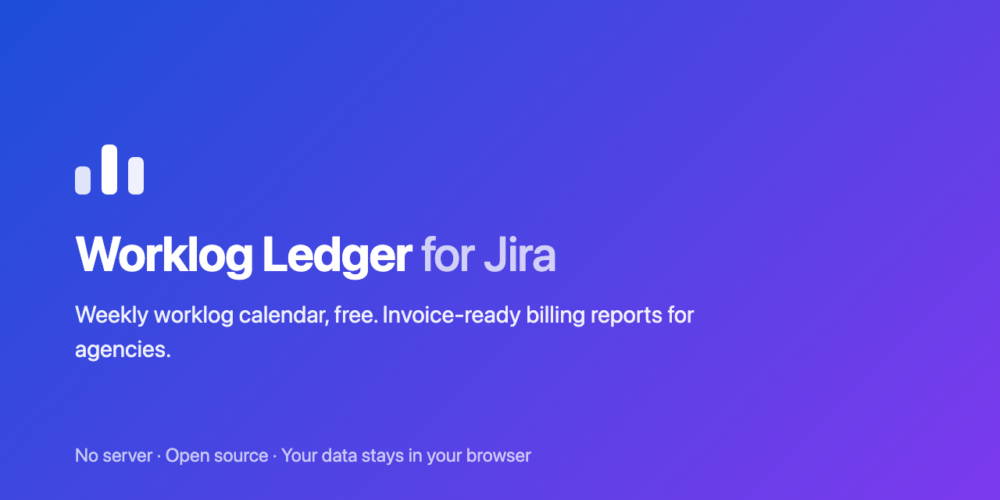

# Worklog Ledger for Jira

Chrome extension for Jira Cloud: a fast weekly worklog calendar (free) plus a
client-billing report layer — rates, billable flags, invoice-ready export (paid).

**Website:** https://worklogledger.cemayan.com · **Status:** v0.1.0 in Chrome Web Store review

No server. Your data stays in your browser (`chrome.storage`). Auth rides your
existing Jira session, with an API-token fallback.

## Layout

- `poc/` — session-reuse auth proof of concept (no build step, "Load unpacked").
  **Status: validated 2026-07-16** — both session reuse and the worklog API work
  against a live Jira Cloud site.
- `src/` — the actual extension (Vite + TypeScript + Preact).

## Development

```sh
npm install
npm run dev     # vite build --watch → dist/
npm run build   # production build → dist/
```

Load `dist/` via `chrome://extensions` → Developer mode → "Load unpacked".
After each rebuild, hit the reload icon on the extension card.

## PoC (kept for reference)

1. Load `poc/` unpacked.
2. Log in to your Jira Cloud site in a tab.
3. Open the popup, enter the site URL, run both tests.
